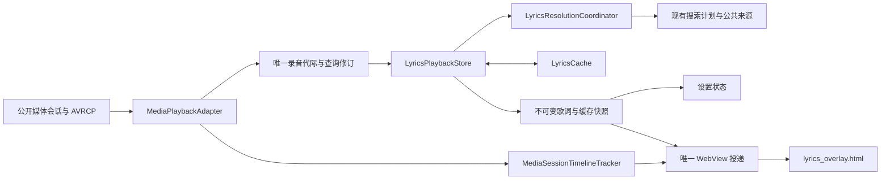

# 媒体与歌词唯一主链重构

2026-09-07 取证修正：03T BluetoothMediaBrowserService 返回毫秒，原先按 SDK 30 指定秒的画像已撤销。公开 Browser 补齐、有限连接与唯一主链继续保留；当前专项施工和验证见 `netease-media-diagnostics.md`。QQ 音乐“车载蓝牙歌词”造成原始字段动态变化属于用户确认的外部行为，本轮不解析复合文本。

## 1. 目标与已确认口径

1. 爱趣听、蓝牙、U 盘、本机音乐与 03T 公开媒体代理共用同一条主链。只接入公开 MediaSession / MediaBrowser 与已经取证的 AVRCP 事件。
2. 当前歌曲已有可信匹配歌词且正在播放时，即使播放位置未知，也立即预览第一句；预览不推进时间、不开放长句横向滚动。可信位置到达后在同一 DOM 立即定位并继续逐句同步。
3. 人工搜索、人工选词、恢复自动继续保留；自动结果不得覆盖已经生效的人工选择。
4. 自动缓存只保留可按当前规则重放证明的记录；数据库升级保留人工记录。显示歌词与当前缓存摘要必须来自同一快照，读缓存中不能被误报为无缓存。
5. 本轮保留商业准入、设置页几何与偏好、原车状态观察、窗口避让和表面租约。实机先验收当前连接设备，03T 不以其它车型的通过结果冒充通过。

## 2. 主链与物理锚点

| 层级 | 来源 / 目标文件与类型 | 入口与约束 |
|---|---|---|
| 媒体适配 | `LyricsOverlayService.kt` -> `MediaPlaybackAdapter.kt` / `MediaPlaybackAdapter` | `updateRecording`、`updateTimeline`、`onAvrcpEvent`；只有被选中来源可以推进时间线，录音代际变化由 tracker 本身处理，服务不在每首歌开始时清掉 tracker 历史 |
| 时间领域 | `MediaSessionTimelineTracker.kt` / 同名类型 | `update`、`restorePosition`；公开位置、检查点和 AVRCP 只重锚同一条本地单调时间线，不存在第二个蓝牙时钟 |
| 应用流程 | `LyricsOverlayService.kt` -> `LyricsPlaybackStore.kt` / `LyricsPlaybackStore` | `acceptPlayback`、`retryCurrent`、`searchManual`、`selectManual`、`restoreAutomatic`、`clearCurrent`；状态只在主线程修改，缓存与目录读取切到 IO；缓存操作用单个 Mutex 顺序执行 |
| 基础设施端口 | `LyricsPlaybackStore.kt` / `LyricsPlaybackCache`，由 `LyricsCache.kt` 实现 | 沿用现有缓存 get / put / putManual / snapshot 规则，只以窄接口隔离 Android SQLite，允许 JVM 以可控存储验证竞态 |
| 快照交付 | `LyricsOverlayService.kt` / `scheduleWebDispatch`、`onLyricsPlaybackSnapshot` | 捕获不可变快照；同一 WebView 队列先提交播放身份再提交对应歌词；运行代际、WebView 实例、录音代际、查询修订均必须匹配；进度更新不重复解析相同正文 |
| 旧路径清理 | `LyricsOverlayService.kt` / 无调用的 `artworkDataUrl`、`bitmapDataUrl`、`mediaVolumePercent`、`currentAudioDeviceLabel` 及其私有辅助方法 | 删除已不进入歌词快照的封面、设备名与音量展示路径；作用域只由 Store 持有，服务保留生命周期 Job；不修改音频路由观察或授权声明 |
| 呈现 | `lyrics_overlay.html` / `receiveLyrics`、`updatePlayback`、`revealProvisionalFirstLine` | 不查询缓存、不发起自动搜索、不决定录音身份；未知进度只预览第一句，就绪后立即定位；暂停保留已显示歌词，停止清除 |
| 设置投影 | `LyricsSettingsModels.kt`、`LyricsSettingsRenderer.kt`、`res/values/strings.xml` | 用同一歌词快照区分读取中、已缓存、仅内存可用；保留已验收的控件和布局 |

新增文件均为 UTF-8，Kotlin 文件头从现有 `LyricsResolutionCoordinator.kt` / `LyricsResolutionCoordinatorTest.kt` 复制 `package com.ninepointnine.desktoplyrics`，不引入中文标识符、命名空间或第三方依赖。`LyricsPlaybackStoreTest.kt` 位于既有 `app/src/test/kotlin/com/ninepointnine/desktoplyrics/`，由 Android Gradle 插件自动包含；落地后立即编译测试源集。

## 3. 明确判定

1. 录音身份、查询修订沿用 `MediaRecordingStateTracker`；时长至少 `1000ms` 可用于查询，累计变化超过 `2000ms` 才重新查询。人工请求绑定录音代际和查询修订，任何替换 / 清除动作同时取消旧自动与人工任务。
2. 所有异步返回在发布前校验所属请求；取消后等待 IO 的任务在取得缓存锁后再次检查取消，禁止晚到写入把已删除缓存复活。人工选择先取消自动解析，再读取点选正文并持久化、回读、统一发布。
3. 自动命中先发布缓存正文及同一次读取生成的摘要；刷新失败保留可用缓存。没有可读持久记录时，在线结果只能标记 `ONLINE_ONLY`。删除缓存允许已经加载的歌词留在内存，并明确区分该状态。
4. 公开时间戳仅在 `0 < timestamp <= elapsedRealtime` 时可用；不变或无效时间戳的变化位置以回调时刻锚定。暂停冻结；位置限制在 `0..durationMs`。
5. 新录音携带超过 `2500ms` 的旧首帧时等待下一份位置证据；冷启动标准会话可用当前有效位置。蓝牙重复零值不能自行宣称就绪。AVRCP 位置只属于接收时的录音代际，事件有效期 `1500ms`，未来或旧代际事件丢弃。
6. AVRCP / 检查点替代控制器位置后，重复的旧位置及仅更新时间戳的同值帧不能回滚时间线。AVRCP 之后的控制器位置必须携带更新且有效的时间戳；蓝牙检查点沿用等待 AVRCP 确认的保守策略；新的 AVRCP seek 立即重新锚定。
7. 播放检查点沿用 `24h` 有效期、同源与同录音匹配、时长差不超过 `2000ms`；双方时长必须至少 `1000ms`，缺失的歌手 / 专辑字段不能作为通配符匹配已知字段。不把歌词第一句预览写为播放检查点。媒体回调保留 `35ms` 合并与现有 `5000ms` 低频发现，禁止新增高频轮询；没有已选来源时不因存在空 Browser 会话而关闭发现。
8. SQLite 当前为 `6`：`4 -> 5` 对每条自动记录重放完整入选证明与缓存键绑定，`5 -> 6` 按第 7 节重建统一归一索引；新记录持久化查询身份。人工原始键、正文、时间与字节数保留，统计在迁移事务内重算；插入失败不得返回成功。

## 4. 必须通过的验证

1. 编译：主源集、JVM 测试源集、受影响 androidTest 源集、`assembleDebug`，迁移变更追加 `lintDebug`。
2. JVM：缓存命中与摘要一致、缓存写入失败、旧结果隔离、人工选择优先、恢复自动、清除期间晚到写入隔离、关闭后无快照；时间线未知转就绪、重复零值、AVRCP seek 后旧帧、暂停 / 恢复、同源重绑定、切歌旧位置、未来时间戳、时长封顶与检查点。
3. SQLite：扩展现有 `LyricsCacheInstrumentationTest` 的旧 schema 到版本 `6` 场景；独立测试设备不可用时不在日常车机安装 androidTest。普通保留数据升级可观察真实迁移、版本和人工记录摘要，记录该证据的覆盖限制。
4. 呈现：新增 `scripts/test-lyrics-overlay.mjs`，从 `app/src/main/assets/lyrics_overlay.html` 直接加载生产 HTML，使用 Playwright 与 Node 标准库验证未知进度第一句可见且不滚动、重复播放快照不清空、有效位置到达立即定位、暂停 / 恢复 / seek / 切歌 / 停止，以及迟到歌词不能进入新歌曲。脚本为现有 `scripts/` 下的 UTF-8 ESM，不引入 Android 依赖，新增后先执行 `node --check`。
5. 实机：`scripts/install-and-smoke.mjs` 保留数据覆盖安装；观察应用启动、唯一服务 / Overlay、致命日志、当前媒体与缓存 / 歌词状态。仅 Debug 启用标准 WebView 检查与不含歌词内容的代际 / 缓存 / 位置日志，用于直接观测真实快照；不增加正式运行依赖。真实 iPhone seek 与跨通道完整播放若缺少手机侧控制，则压缩为最后的现场确认，不伪造 AVRCP 广播。
6. 文档：`check-project-docs.mjs`、`check-skills.mjs`、`git diff --check`；任何必须项失败先修复，不以编译成功替代运行证据。

## 5. 次生风险

暂无明确次生风险。未知进度下的第一句仅为预览，不能作为时间线或持久进度；当前车机与 03T 的验证结论必须分开记录。

## 6. 实机发现后的接入层修订

1. 当前车机实测：iPhone 的 Apple Music、QQ 和网易云均能取得歌词但停留第一句；Android 手机可正常推进。只读 WebView 与日志确认 iPhone 会话反复发布同一旧位置，时间戳更新不代表真实位置更新。已订阅的 `TRACK_EVENT` 与位置通知不足以覆盖固件完整的 AVRCP 输出。
2. 通过当前固件 `Bluetooth` 的 `A2dpMediaBrowserService` 与 nFore 的 `NfDoCallbackAvrcp` / `NfPrimitive` 字节码取证：`PLAYBACK_POS_CHANGEDS` 使用 `profile.extra.SONG_POS`；`PLAY_STATUS` 同时携带 `extra.SONG_POS`、`extra.SONG_LEN` 和 Android 语义的 `profile.extra.PLAYBACK`；`PLAYBACK_STATUS_CHANGED` 可携带 `extra.SONG_POS` 或原始 AVRCP `extra.PLAY_STATUS_ID`。原始状态 `0/1/2/3/4` 分别归一为 Android 停止 / 播放 / 暂停 / 快进 / 快退。接入只读已确认广播，不调用固件私有控制方法，不按手机品牌或播放器包名分支。
3. 物理锚点：从 `LyricsOverlayService.kt` 的 `avrcpEventReceiver`、协议常量和 Bundle 数字读取迁入现有 `MediaPlaybackAdapter.kt`，同文件新增 `AvrcpPlaybackEvent`、`AvrcpPlaybackEventDecoder` 与 `MediaPlaybackFrame`。Decoder 唯一声明支持的动作集合，Receiver 直接使用该集合注册，避免订阅和解析两处名单漂移。Adapter 输入归一录音字段、输出同一次归一后的播放状态和时间线，接管事件状态；服务不保留第二份蓝牙播放状态或同形时间线 DTO。
4. 数值边界：位置只接受整数 `0..86_400_000ms`，拒绝负值、非整数、字符串及 AVRCP `0xffffffff` 未知值；缺少位置的状态或元数据事件不能生成 `0ms` 证据。完整快照含有效时长时，必须与当前录音时长相差不超过既有 `2000ms` 才能绑定位置；事件沿用当前录音代际、单调接收时刻与 `1500ms` 有效期，随后仍由唯一时间线处理旧控制器帧、暂停和 seek。
5. 新增 `app/src/test/kotlin/com/ninepointnine/desktoplyrics/MediaPlaybackAdapterTest.kt`，包声明、JUnit 引入从 `MediaSessionTimelineTrackerTest.kt` 复制，UTF-8、既有 Gradle 测试源集自动包含，无新依赖。用固件真实字段形状覆盖两类位置通知、完整状态快照、状态枚举、缺失 / 错误字段、旧录音时长、暂停、自然推进和 seek 后旧控制器帧；直接运行“协议解码 -> Adapter -> 时间线”，不只注入已经归一的位置。
6. 必须通过：新增协议闭环与原时间线 / 元数据 / 设置测试、`assembleDebug`、受影响 androidTest 编译、文档检查、保留数据安装与真实 WebView / 日志 smoke；取得 iPhone 与 Android 的不同入口证据并分别记录。既有缓存迁移已实机验证版本 `4 -> 5`、完整性正常、三条人工记录摘要完全一致，此修订复用该证据。

## 7. 重启恢复的身份一致性审计

1. 用户已确认 iPhone 主测通过；随后爱趣听在真实车机重启后无歌词、当前歌曲显示无缓存，切歌后恢复。只读数据库仍为版本 `5`、完整性正常，保留重启前的自动及人工记录。不能将“当前查不到”直接解释为缓存被删除，也不能将切歌成功写为启动成功。
2. 已定位的结构性冲突：`MediaRecordingStateTracker` 使用 `RecordingIdentity.kt` 的 `normalizeText` 比较歌名、歌手与专辑；`LyricsCache.key` 却对显示文本整体做 NFKC / 大小写处理。对于 `Artist A / Artist B` 与 `Artist A/Artist B`，录音代际与查询修订不变，缓存地址却不同。先在既有 `LyricsCachePolicyTest.kt` 通过真实 tracker 与缓存入口固定该不变量失败，不用歌曲专用规则代替身份一致性。
3. 领域与持久化边界：缓存身份使用同一个 `normalizeText` 字段规则，完整歌名保留版本文字，时长仍以毫秒真值校验，索引使用秒桶和既有 `2000ms` 查询窗口。索引只负责定位候选，自动正文仍由 `LyricsCandidateSelector.isProofValid` 重放完整证明，人工正文仍绑定人工选择时的录音；不放宽匹配准入。
4. 物理锚点：原位调整 `LyricsCache.kt` 的 `key`、`get`、`findManualEntry`、`put` / `putManual`、清除动作与 `CacheDatabase`。数据库 `5 -> 6` 增加单一 `recording_key` 列及索引，旧 `cache_key` 仅作行地址；从持久查询身份重建索引，旧人工键、正文、时间与计数逐字节保留。新写入使用归一后的键，同一归一键下的旧地址由一次事务收敛，统计扣除实际删除字节。自动与人工候选读取分别收敛到 `findAutomaticEntries` / `findManualEntries`，删除复用同一次真实毫秒校验后的行地址，不能把秒桶候选直接当作同一录音删除。原始旧键算法仅用于旧记录绑定验证，不作为运行态第二种查询身份。
5. 应用流程边界：`LyricsOverlayService.updateCurrentRecordingState` 每次把当前不可变录音状态交给 `LyricsPlaybackStore.acceptPlayback`；取消与幂等判断只由 Store 拥有，服务不以一次性的 changed 标记决定下游是否有资格看到当前状态。已有 Store 测试覆盖重复快照不重复读缓存，追加已识别录音绑定新 Store 的首次缓存加载场景。检查点文字比较复用同一字段归一，仍严格要求同来源、有效时长与 `24h` 有效期。
6. 测试锚点均在已有文件原位修改，UTF-8 文件头沿用磁盘源码，无新增命名空间或依赖。必须通过：身份格式变化的缓存 / 录音一致性、版本与时长反例、旧记录索引迁移证明、人工记录不改写、缓存回读 / 删除与统计、Store 首次状态重放与幂等、原时间线及媒体测试；编译 `LyricsCacheInstrumentationTest`，执行 `lintDebug assembleDebug`、保留数据升级及实际数据库版本 / 索引 / 人工记录摘要对照。运行验证必须分别记录当前服务重建与真实车机上电，前者不能冒充后者。

## 8. 公开媒体初始快照的完整性契约

1. 已取得同曲重建证据：重建前公开时长 `172245ms`、位置约 `81s` 且有歌词；重建后歌曲三字段相同，但时长、位置均为 `0`，持续约 `90s`，自然下一首才恢复。当前固件公开 `MediaPlaybackService` 的创建路径先用零时长发布元数据，`onGetRoot` 发布 `STATE_NONE / 0ms`；后续进度监听只在自身刷新标志成立时补发时长。标准 `MEDIA_ID` 来自当前媒体条目。根因属于适配器输入契约：一次公开回调不是完整歌曲快照，不能用缺失字段否定已确认事实，也不能用初始化零值宣称位置就绪。
2. 领域锚点：原位修改 `MediaSessionMetadataPolicy.kt` 的 `MediaSessionMetadataFields`、`MediaRecordingMetadata` 和 `MediaRecordingStateTracker`，保留可选的标准 `mediaId`，ID 为不做文本归一的来源内标识。双方 ID 非空且不相同时切换录音代际；相同 ID 的缺失字段补齐不制造新代际；标题、歌手、专辑的既有冲突边界仍有效。ID 后补本身不重复查词。
3. 新增适配器事实存储 `app/src/main/kotlin/com/ninepointnine/desktoplyrics/MediaRecordingFactsStore.kt` / `MediaRecordingFactsStore`，文件头从 `MediaPlaybackAdapter.kt` 复制 `package com.ninepointnine.desktoplyrics`，JSON 依赖从 `LyricsCache.kt` 复制。既有 Gradle Kotlin 源集自动包含，UTF-8、无新依赖。`resolve(sourceId, incoming)` 只接收实际公开媒体元数据，保存“来源 + 非空公开 ID + 归一三字段 + 实际时长”，最多 `128` 条，只有事实改变时更新持久 JSON。存储读写通过构造参数装配到现有私有 preferences，不接触歌词缓存或网络。
4. 恢复阈值：持久时长必须在 `1000..86400000ms`；仅当来源、公开 ID、归一后的歌曲三字段全部相等且本次时长为 `0` 时恢复。不得覆盖任何正的实时值，不从歌词候选或旧检查点反推时长，不跨来源 / 歌曲复用，不放宽自动歌词匹配的 `2000ms` 边界。无 ID 或尚未观察过完整信息时仍等待实际发布，已有匹配歌词的第一句预览策略保持有效。
5. 时间入口锚点：`MediaPlaybackAdapter.updateRecording` 先合并已确认事实，再交给唯一录音 tracker；单独保留当前原始发布时长作为输入证据。`updateTimeline` / `restoreTimeline` 从当前录音读取代际及有效时长，删除调用方重复传入的身份和时长。原始时长不可用且控制器报告 `0ms` 时，将该位置作为未知交给既有时间线；真实正位置或带可用时长的零位置继续正常重锚，已验证 AVRCP 显式零位置仍有效，不增加第二个时钟。
6. 持久进度锚点：`MediaPlaybackCheckpoint`、`MediaPlaybackCheckpointPolicy.matches` 与服务既有检查点读写增加可选 `mediaId`。任一方具有 ID 时要求双方 ID 完全相等，同时保留同来源、归一三字段、有效时长、`2000ms` 与 `24h` 约束。只有旧检查点缺少 ID 时不推测补齐；新的真实位置建立新检查点。
7. 选源锚点：在 `MediaSessionSelectionPolicy.kt` 的 `MediaSessionArbiter` 抽取唯一 `isColdStartCandidate` 条件，preferred 与普通冷选共用“播放 / 缓冲 / 有标题的暂停”。`STATE_NONE`、停止、错误和未知状态不得凭上次来源被选中，避免初始化会话被选中再清除以及清掉有效恢复数据。
8. 装配锚点：`LyricsOverlayService.kt` 从 `METADATA_KEY_MEDIA_ID` / 标准 `MediaDescription.mediaId` 读取 ID，装配事实存储，使用 Adapter 的有效元数据构建快照。Debug 日志分别记录公开时长与有效时长，不把完成事实补齐的状态继续报告为无时长；不增加设置、窗口、商业或车辆状态分支。
9. 测试锚点：新增 `MediaRecordingFactsStoreTest.kt`，包声明和 JUnit 引用从 `MediaPlaybackAdapterTest.kt` 复制。先编译新增主源 / 测试源，再继续后续修改；覆盖持久 JSON 往返、同 ID 恢复、来源 / ID / 三字段反例、正值不覆盖、无 ID、不完整 / 损坏数据、容量与重复回调零写入。原位扩展 `MediaPlaybackAdapterTest` 验证“首次完整观察 -> 新 Store / Adapter 冷建 -> 零时长 / 零位置 -> 严格检查点恢复 -> 连续推进 -> 实时位置重锚”，以及真实零进度和 AVRCP 回归；元数据、仲裁与时间线测试覆盖 ID 后补 / 冲突、preferred 初始化状态和检查点身份。
10. 必须通过：上述定向 JVM、既有 Store / 缓存 / 公开 Browser 回归、受影响 androidTest 编译、`assembleDebug`、保留数据覆盖安装与基础 smoke。安装后等待一次完整真实媒体观察建立 ID 绑定，在同一首歌播放中使用应用自身重建入口验证歌曲身份、时长、缓存、正文和时间线连续；对照实际版本 `6` 数据库与安装前人工记录摘要。真实车机重启由用户在收到明确测试通知后操作，现场复核不以服务重建代替；03T 缺实机的边界保持独立。暂无明确次生风险。

## 9. 最终审计与 03T 公开服务连接预算

1. 用户已确认爱趣听真实重启测试通过。本次审计继续验证唯一主链，以及此前 03T 公开媒体代理、稳定展示字段和蓝牙时长画像是否保留；不将当前 iCAR 03 主测结果写成 03T 已实测。
2. 用户返回的诊断文件可解析前缀列出 `10` 个公开 Browser 服务，包括在线代理 `com.tencent.wecarflow/.player.MediaPlaybackService`、同包 HDD / USB、标准本地媒体服务和 Android 11 蓝牙 Browser。报告末尾截断，不能当作完整的 `30s` 采样；诊断采集器的固定字段列表不包含 `MEDIA_ID`，也不能据此认定 03T 缺失公开 ID。
3. 根因位于适配器发现与连接的边界：`PublicMediaBrowserServiceResolver.discover` 曾在识别当前活动包 / 上次稳定来源前截取 `8` 个描述符，注册表随后又截取一次。来源落在列表尾部时，偏好和活动证据无法使其重新进入候选。
4. 原位修改 `PublicMediaBrowserSessionRegistry.kt`：`resolveServices` 统一对公开服务执行准入和去重，发现阶段保留完整描述符；既有 `select` 在注册表完成准入过滤后，按“上次稳定来源、当前活动包、其它合格服务”的顺序分配连接，同级保留发现顺序，最后且仅在此处应用 `MAX_SERVICES = 8`。此优先级只分配连接，真正播放来源仍由 `MediaSessionArbiter` 决定。超时 `3000ms`、一次 `1000ms` 重试、冷发现 `30000ms` 和低频刷新保持既有契约。
5. 验证锚点在现有 `PublicMediaBrowserSessionRegistryTest.kt` 和 `MediaPlaybackAdapterTest.kt` 原位扩展；文件头、包声明、JUnit 和 Android 类型沿用现有源码，UTF-8，不新增文件、命名空间或依赖。验证超过预算的完整发现、尾部活动 / 偏好来源进入连接集合、稳定运行释放其它连接，以及报告相同字段形状下的动态原始标题、稳定展示字段、毫秒时间线和可选 ID。
6. 必须通过：上述测试及媒体选源 / 元数据 / 时间线定向回归、`assembleDebug`、保留数据安装与基础 smoke、文档 / Skill / diff 检查。复用本轮已通过的歌词缓存、迁移与用户主测证据；03T 没有本次可连接实机，仍需在对应车机确认重启原曲、暂停 / 拖动和通道切换。暂无明确次生风险。
